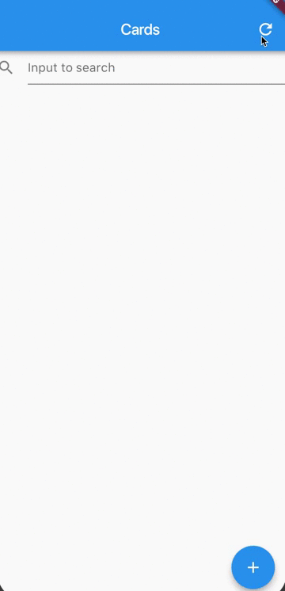
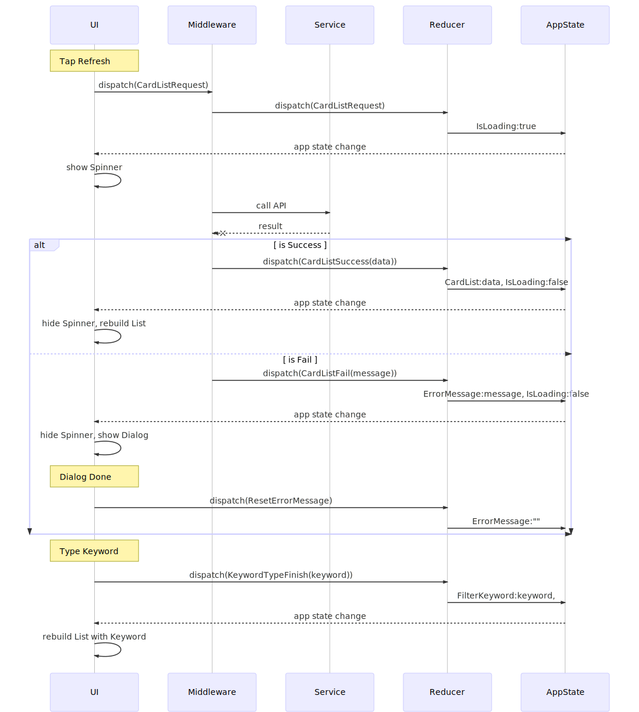
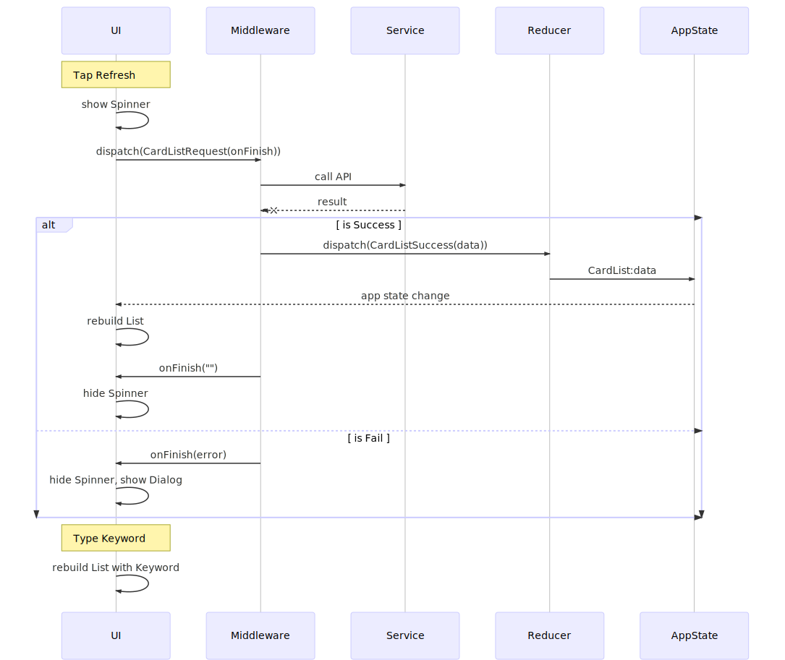

## Simplify using Redux with Flutter

These days you may here about raising star of mobile cross platform [Flutter](https://flutter.io), I'm also and decided to check, quickly I become a fan of Flutter. 

But instead of have one strong recommend development pattern, you can write Flutter in many ways which make you confuse. There are a lot of wonderful writing about Flutter development pattern for you to choose, such as [Flutter architecture samples](https://github.com/brianegan/flutter_architecture_samples), [scoped_model](https://pub.dartlang.org/packages/scoped_model) and [Flutter MVP architecture](https://medium.com/@develodroid/flutter-iv-mvp-architecture-e4a979d9f47e). Among of these pattern, I decided to try [Redux](https://pub.dartlang.org/packages/redux) pattern which I heard a lot about it but have no change to practice. 

In this writing, I don't intend to explain about [Flutter-Redux](https://pub.dartlang.org/packages/flutter_redux) and I assume you already read and familiar with it, instead I want to share my trouble and solution when I try to practice with Flutter-Redux.

#### The Application

Ok, let's make simple application for practice. The application is about download a Card list from Server, display it with a filter and able to add more Card data, simple enough but have some foundation for a real world application. 

Below is how my project evolve:

#### Part1: Load and display the List

The requirement is:

* Tap to refresh button to start getting list through API, show indicator, show dialog in case error or update list in case success, stop indicator.

*  Type to text field to locally filter data by keyword

I'm newbie of Redux, I put all data into the Store just because I thought that’s how it was supposed to work. Here is Redux setup:

**AppState**
* ListData
* IsLoading
* ErrorMessage
* FilterKeyword

**Action**
* CardListRequest
* CardListSuccess(data)
* CardListFail(message)
* ResetErrorMessage
* KeywordTypeFinish(keyword)

**Flow**

It's seem many setup but it's worth. The good point is now your Biz layer is completely separate out of UI layer, you can unit test the biz or even the UI state without building the UI. Cool !!! 🤗

At this point I totally satisfy with my setup despite some strange in storing UI state in AppState like isLoading, errorMessage, filterKeyword or the unnecessary of resetErrorMessage action since my application is still small enough to handle.🤪

But soon when I implement Add card function I got headache to manage AppState. Let's move to Part2 for implement Add function

#### Part2: Implement Add function

The requirement is:

* Tap to add button to start post new Card through API, show indicator, show dialog in case error or update list in case success, stop indicator.

In order not to mess thing up, I decided add 2 more state to IsLoading and ErrorMessage for deal with AddCard action. Here is Redux setup:

**AppState**

- ListData
- IsLoading
- ErrorMessage
- FilterKeyword
- *IsAddCardLoading*
- *AddCardErrorMessage*

**Action**

- CardListRequest
- CardListSuccess(data)
- CardListFail(message)
- ResetErrorMessage
- KeywordTypeFinish(keyword)
- *AddCardRequest*
- *AddCardSuccess(data)*
- *AddCardFail(message)*
- *ResetAddCardErrorMessage*

At this point, the AppState and Action list like a mess 😱. Seriously, 80% of code is just for handling isLoading and errorMessage, manage this mess is waste of time and easy to get mistake. 

I was supposed to give up Redux to get back to my familiar way with MVP and Singleton pattern, but I still wanted to give Redux a shot. I did research a little bit and find some [good advices](https://dev.bleacherreport.com/3-things-i-learned-about-working-with-data-in-redux-5fa0d5f89c8b) to deal with my situation, and the solution is: 

> *Moving UI State into the Component*

Ok I reset my mind and start to simplify using Redux with above term, let cut out the mess with Part3.

#### Part3: Simplify using Redux

To simplify Redux structure, my target is only store which data are shared across the UI components in AppState, otherwise keep UI state in UI component. 

This time UI component active in control UI with their own state like showing Spinner on button tapped event.

I'm also establish the bridge between UI and Middleware by callback function to let UI update flow easier, every time Middleware finish the job, send back to UI to update state immediately. Here is Redux structure:

**AppState**

- ListData

**Action**

- CardListRequest(onFinish(error))

- CardListSuccess(data)

- AddCardRequest(onFinish(error))

- AddCardSuccess(data)

**Flow**

How's about this, much more simple isn't it? 🤗

> *Shared data is store in AppState and UI state store in UI component*

I don't know whether this is best practice or not but it work on me and I actually applied to a real world project, you can refer to [source code](https://github.com/csnguyen-gmail/flutter_redux_architecture) for reference to start a Flutter-Redux project.

Thanks for some precious advices from my colleagues in [SK-GEEK](https://medium.com/sk-geek) group.

Any comment is welcomed! Happy coding!