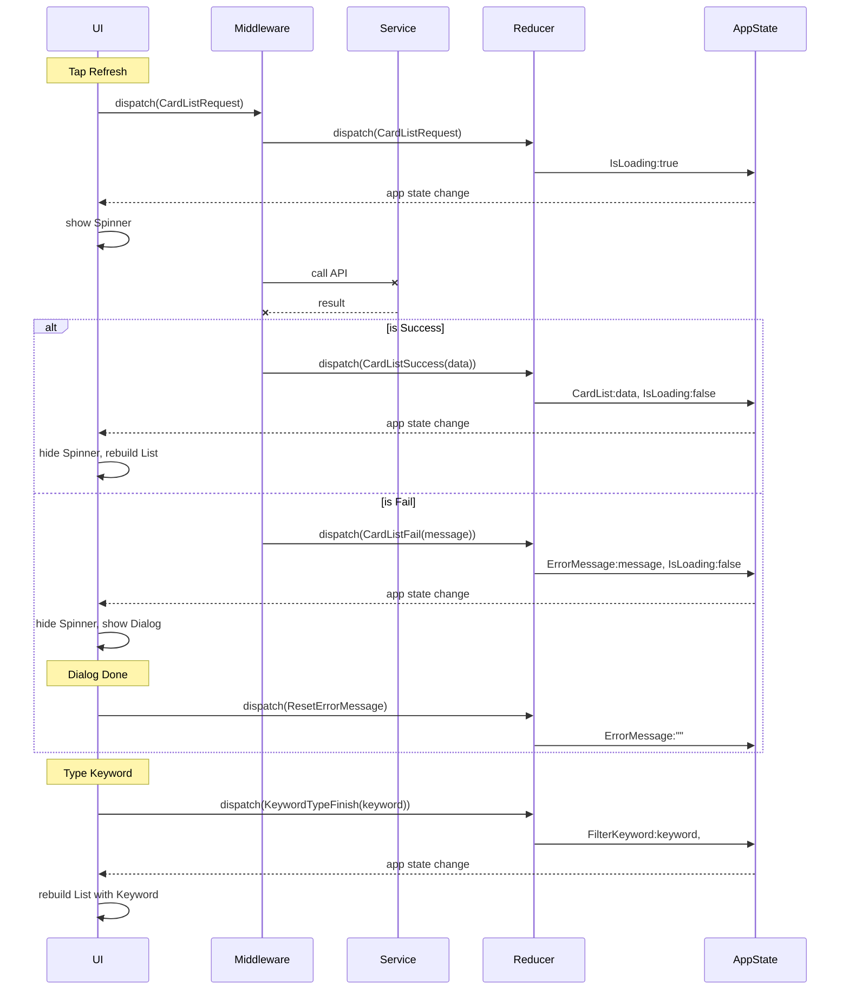
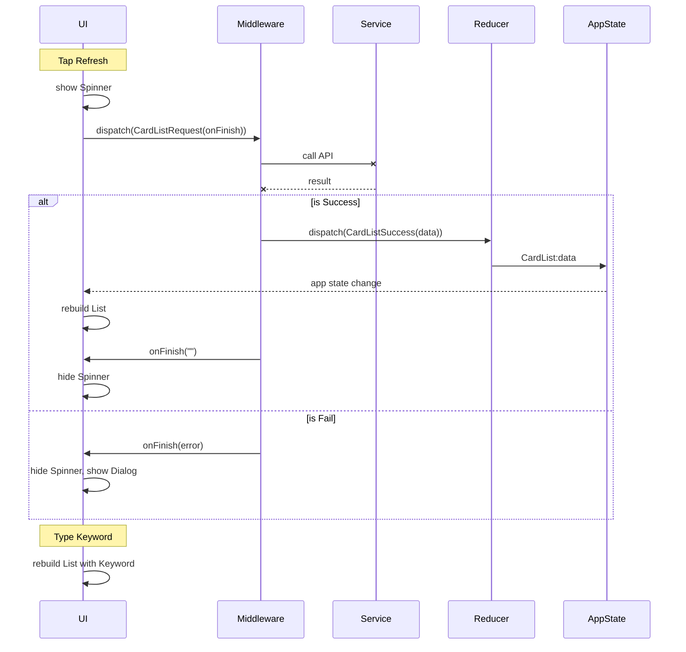

Part1

```mermaid
sequenceDiagram
participant U as UI
participant M as Middleware
participant S as Service
participant R as Reducer
participant A as AppState
Note over U: Tap Refresh
U->>M: dispatch(CardListRequest)
M->>R: dispatch(CardListRequest)
R->>A: IsLoading:true
A-->>U: app state change
U->>U: show Spinner
M-xS:call API
S--xM:result
alt is Success
	M->>R: dispatch(CardListSuccess(data))
	R->>A: CardList:data, IsLoading:false
	A-->>U: app state change
	U->>U: hide Spinner, rebuild List
else is Fail
	M->>R: dispatch(CardListFail(message))
    R->>A: ErrorMessage:message, IsLoading:false
    A-->>U: app state change
    U->>U: hide Spinner, show Dialog
    Note over U: Dialog Done
    U->>R: dispatch(ResetErrorMessage)
	R->>A: ErrorMessage:""
end
Note over U: Type Keyword
U->>R: dispatch(KeywordTypeFinish(keyword))
R->>A: FilterKeyword:keyword,
A-->>U: app state change
U->>U: rebuild List with Keyword
```

Part3

```mermaid
sequenceDiagram
participant U as UI
participant M as Middleware
participant S as Service
participant R as Reducer
participant A as AppState
Note over U: Tap Refresh
U->>U: show Spinner
U->>M: dispatch(CardListRequest(onFinish))
M-xS:call API
S--xM:result
alt is Success
	M->>R: dispatch(CardListSuccess(data))
	R->>A: CardList:data
	A-->>U: app state change
	U->>U: rebuild List
	M->>U: onFinish("")
	U->>U: hide Spinner
else is Fail
	M->>U: onFinish(error)
	U->>U: hide Spinner, show Dialog
end
Note over U: Type Keyword
U->>U: rebuild List with Keyword
```